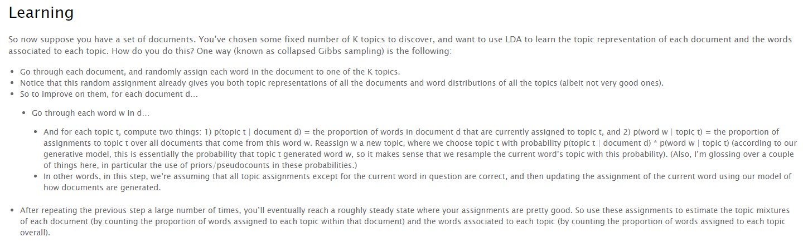

## digest
Combination of document d,topic t,word w accords to following distribution:  
(d,t,w) ~ p(t|d)p(w|t)  

Document generation,topic assignment of word follow this distribution  
This distribution can be learned by :  
- randomly assigning topic to each word(distribution initialization)
- repeatly reassign topic with currently observed distribution(assuming all assignments except for current word are right) till convergence

## credits
<a href='https://blog.echen.me/2011/08/22/introduction-to-latent-dirichlet-allocation/'>Introduction to Latent Dirichlet Allocation</a>

